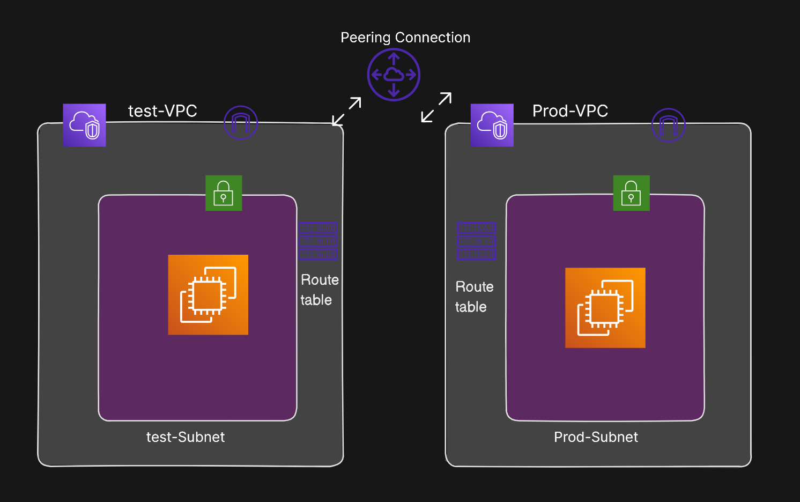
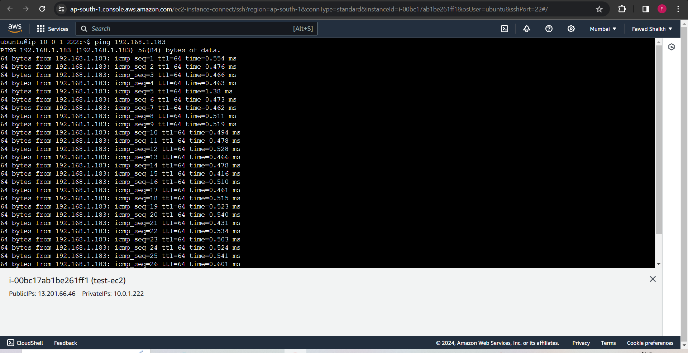
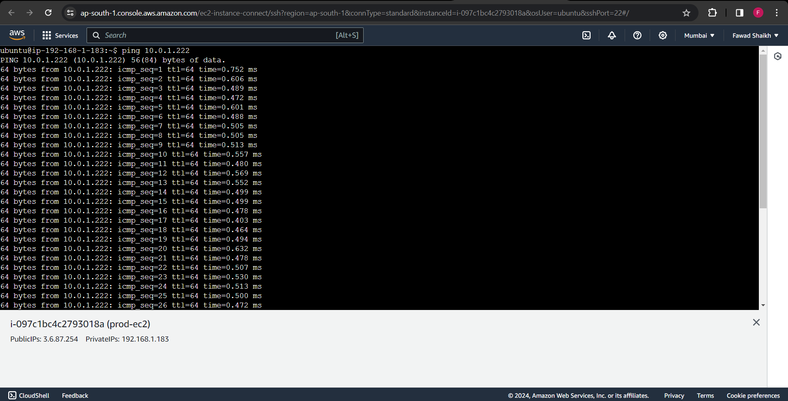

# AWS VPC Peering Project

## Overview

This project demonstrates the setup of Virtual Private Cloud (VPC) Peering in AWS, connecting two VPCs—`test` and `prod`. It includes the creation of route tables, subnets, internet gateways, and EC2 instances in each VPC. VPC Peering is established, allowing private communication between instances in different VPCs.

  


## VPC Configuration

### Test VPC

- **VPC Name:** test-vpc
- **IPv4 CIDR Block:** 10.0.0.0/16
- **Internet Gateway**
- **Subnets:** 
  - test-subnet: 10.0.1.0/24
- **Route tables**
  - associate the subnet
  - add igw route
  
### Prod VPC

- **VPC Name:** prod-vpc
- **IPv4 CIDR Block:** 192.168.0.0/16
- **Internet Gateway**
- **Subnets:** 
  - prod-subnet 1: 192.168.1.0/24
- **Route tables**
  - associate the subnet
  - add igw route

  
## EC2 Instances

- **Instance 1 (test VPC):**
  - Instance Type: t2.micro
  - Security Groups: Allow SSH, HTTP, ICMP

- **Instance 2 (prod VPC):**
  - Instance Type: t2.micro
  - Security Groups: Allow SSH, HTTP, ICMP

## VPC Peering

- **Peering Connection Name:** test-prod-peering
- **Allow/Deny Traffic:** Allow traffic between VPCs
- Add routes in both route tables for peering connection

## Verification

To ensure VPC peering is working:

1. SSH into the test  instance and ping the private IP of the prod instance.
   ```bash
   ping [Prod Instance Private IP]

  

2. SSH into the prod instance and ping the private IP of the test instance.
   ```bash
   ping [test Instance Private IP]
  
